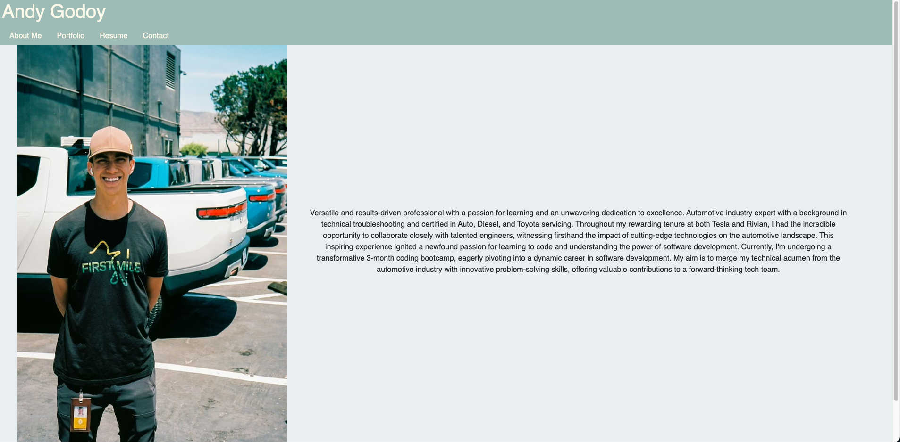
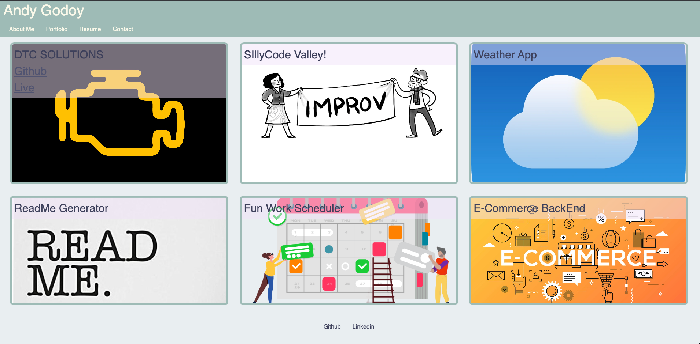
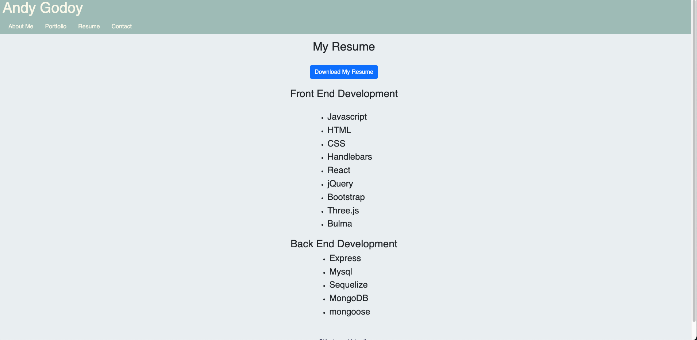
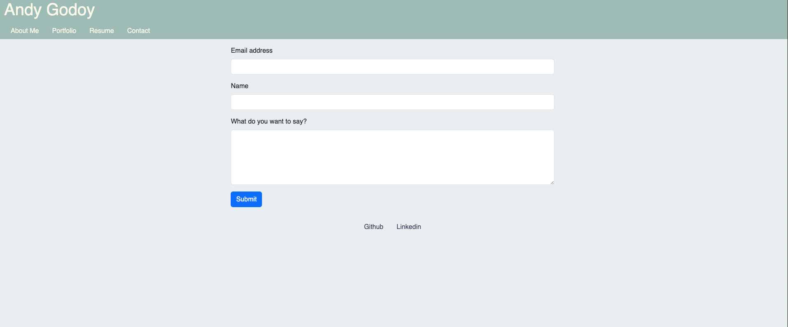

# React-Portfolio
Creating a portfolio using react

This is a single-page application portfolio for a web developer, showcasing their work, skills, and contact information.

## Table of Contents
- [Description](#description)
- [Features](#features)
- [Usage](#usage)
- [Screenshots](#screenshots)
- [Technologies Used](#technologies-used)
- [Installation](#installation)
- [License](#license)
- [Contact](#contact)

## Description

This single-page application portfolio is designed to provide information about the web developer's skills, projects, and contact details. It offers a user-friendly experience with a responsive design.

## Features

### Header
- Displays the developer's name.
- Navigation with titles corresponding to different sections of the portfolio.
- The current section's title is highlighted.

### Navigation Titles
- Includes the following titles: About Me, Portfolio, Contact, and Resume.
- Clicking on a navigation title loads the corresponding section without page reloading.
- The clicked title is highlighted.

### Default Section
- When the portfolio is loaded for the first time, the "About Me" title and section are selected by default.

### About Me Section
- Contains a recent photo or avatar of the developer.
- Provides a short bio about the developer.

### Portfolio Section
- Displays titled images of six of the developer’s applications.
- Provides links to both the deployed applications and corresponding GitHub repositories.

### Contact Section
- Includes a contact form with fields for name, email address, and a message.
- Provides user notifications for empty fields and invalid email addresses.

### Resume Section
- Features a link to download the developer's resume.
- Lists the developer’s proficiencies.

### Footer
- Includes text or icon links to the developer's GitHub, LinkedIn, and a third platform (Stack Overflow, Twitter, etc.).

## Usage

To use this portfolio application, simply navigate through the sections using the provided navigation links.

## Screenshots

## Technologies Used

- HTML
- CSS
- JavaScript
- [Add any other technologies used]

## Installation

There is no need for installation. This is a client-side application that can be accessed through a web browser.

## License

This project is licensed under the [License Name] License - see the [LICENSE.md](LICENSE.md) file for details.

## Contact

If you have any questions or suggestions, please feel free to contact the developer:

- GitHub: [GitHub Profile](https://github.com/AndyGodoy)
- LinkedIn: [LinkedIn Profile](https://www.linkedin.com/in/andy-godoy-173111280/)